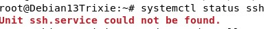

# Pkg file service

## x) Lue ja tiivistä
- Artikkelissa oli selkeät SSH staten tekemiseen.
- Package-file-servicen avulla voi hallita suuria määriä daemoneita. 
## a) 

- Tajusin, että jostain syystä sshd ei ole asennettuna joten asensin sen.
-   
  
