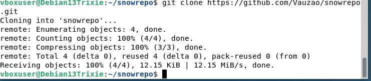
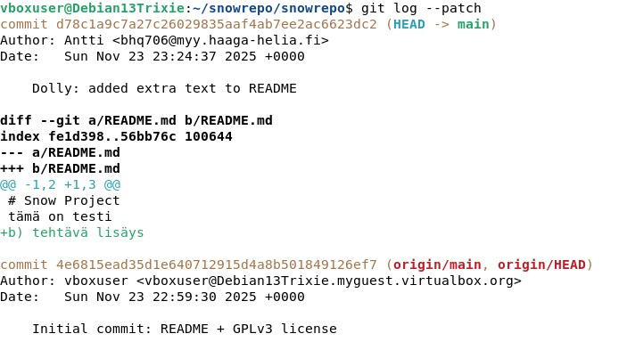
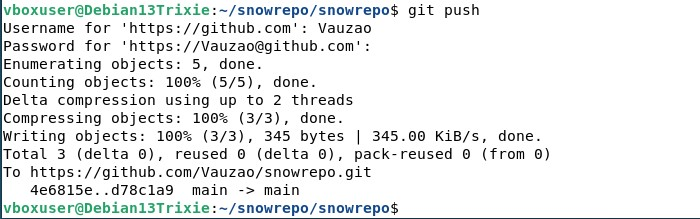
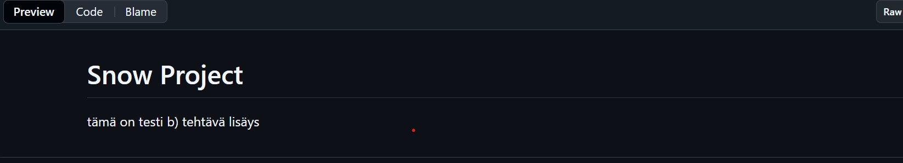
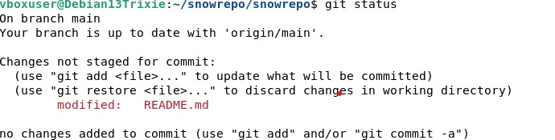
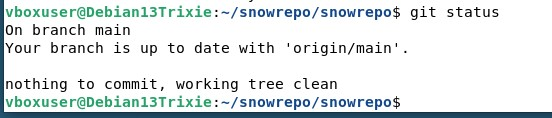
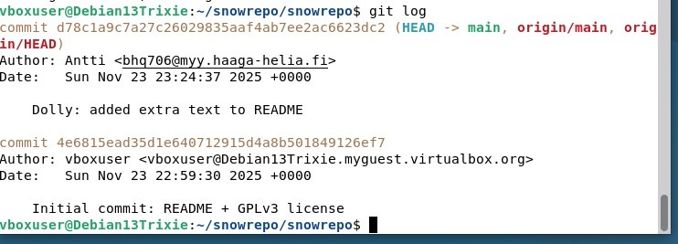
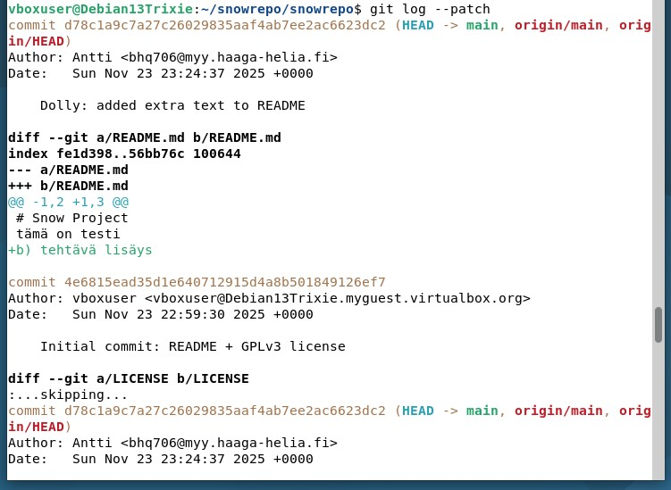
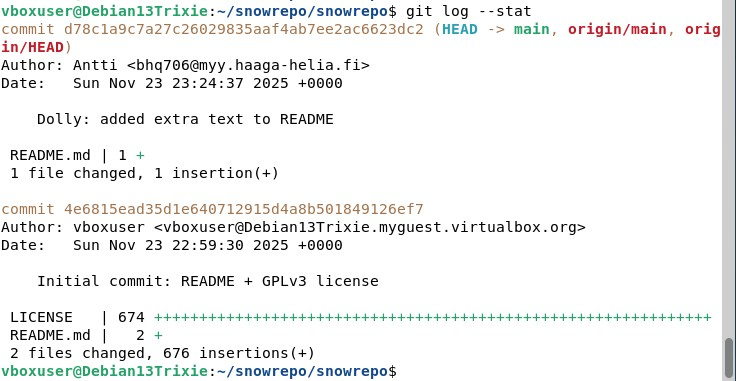

# H5 Toimiva versio
## x) Lue ja tiivistä
Chacon and Straub 2014:
- 
## a) Online
- aluksi mkdir ja cd tehtävää varten
- 
- Se aloitetaan komennolla: git init
- 
- Tässä välissä tehdään tekstitiedosto tehtävää varten ja lisätään sinne tekstiä
- sitten Lisätään gnu gpl 3 lisenssi:
- 
- Tiedoston lisäys git add ja commit:
- 
- Tässä välissä sähköposti ja käyttäjänimi lisäys komennoilla: git config --global user.email ja git config --global user.name
- - Sitten tein githubiin uuden repon tehtävälle
- Kopioin sieltä: git remote add origin"", git branch -M main ja git push -u origin main
- Ja hain tokenin jotta pystyin syöttämään sen debianiin
- 
- Tässä näkyy lopputulos kaikki git toimii
- 
  
## b) Dolly
- kloonasin gitin
- 
- Muokkasin tekstiedostoa
- 
- Lisäsin ne gittiin ja committasin
- 
- Tarkistin logista muutoksen
- 
- push palvelimelle
- 
- Muutokset githubissa
- 

## c) Doh!
- Muokkasin aluksi tekstitiedostoon turhaa tekstiä
- 
- Tarkistin statuksesta että oli "modified"
- 
- Ja tuhosin muutokset 
- 
- statuksesta tarkistus
- 

## d) Tukki
- Tarkistin lokin, siinä näkyy esim. commitit ja author 
- 
- Käytin lisäksi vielä: git log --patch, lokin yksityiskohtaiseen tarkastukseen
- 
- ja tarkastelin vielä lisää...
- 
